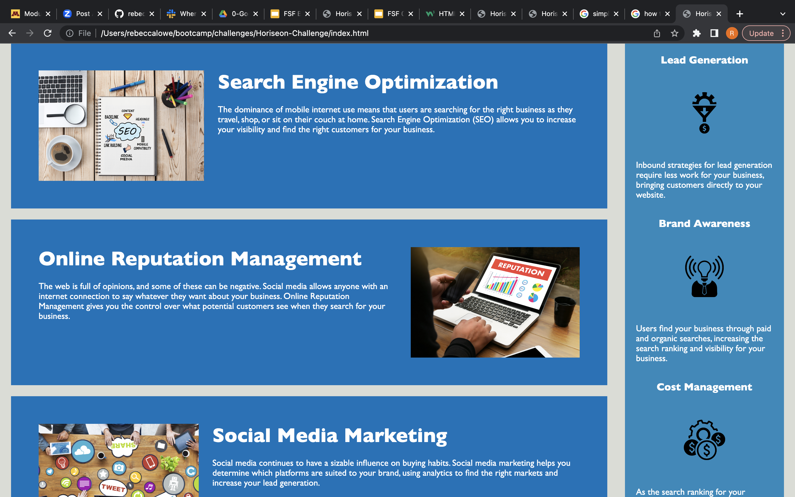
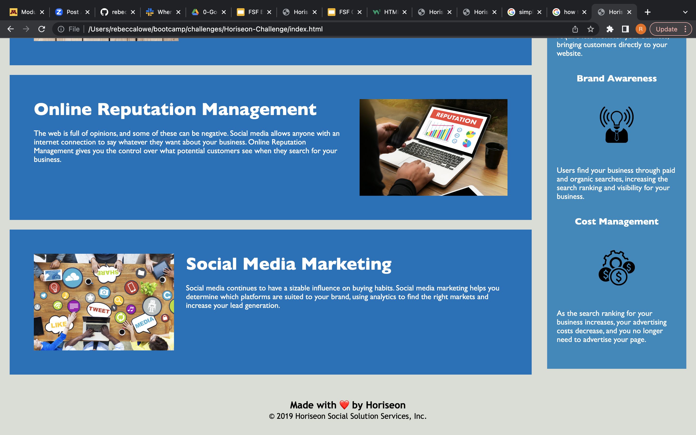

# Horiseon-Challenge

## User Story
As a marketing agency, I want a codebase that follows accessibility standards, so that our own site is optimized for search engines.

## Description
The Horiseon webpage and codebase allows for marketing agencies to have access to learning about a solution for managing web presence through the usage of search engine optimization. In addition, information regarding maintaining a positive online reputation to attract business clients and easy social media marketing are available to agencies through the Horiseon webpage and links. The codebase has been polished to include "alt" attributes, a descriptive web title, as well as semantic and logical HTML elements. 

## Links:
file:///Users/rebeccalowe/bootcamp/challenges/Horiseon-Challenge/index.html

## Installation

N/A

## Credits

N/A

## License

Please refer to the LICENSE in repo.

---

